# **Введение** 

Целью данной курсовой работы является практическая реализация
клиент-серверного чат-приложения с использованием языка программирования
Java и базы данных MySQL. Проект направлен на закрепление теоретических
знаний и развитие навыков разработки сетевых приложений, а также на
изучение принципов построения безопасного обмена сообщениями между
пользователями. Одной из ключевых особенностей разработанного приложения
является использование собственного легковесного алгоритма транспортного
шифрования, что позволяет обеспечивать защиту данных на этапе передачи
без применения стандартных протоколов TLS/SSL.

Выбор языка Java обусловлен его широким распространением, развитой
экосистемой и поддержкой сетевого программирования. Кроме того, Java
предлагает средства для создания как графического интерфейса
пользователя, так и серверной части, что делает его идеальным решением
для разработки полнофункционального клиент-серверного приложения. Для
реализации графического интерфейса клиентского приложения использована
библиотека Swing, предоставляющая гибкие инструменты построения
интерфейсов на настольных системах. Все элементы интерфейса выполнены на
русском языке, что упрощает взаимодействие пользователя с системой.

База данных MySQL используется для хранения пользовательской информации
и истории сообщений, что обеспечивает постоянство данных и возможность
последующего анализа. В процессе выполнения курсовой работы была
реализована многопоточная серверная архитектура, позволяющая
одновременно обслуживать нескольких клиентов и обеспечивать приватный
режим общения \"один-на-один\".

Данный проект предоставляет ценный опыт работы с клиент-серверными
технологиями, криптографией, графическим интерфейсом и системами
управления базами данных. Также он развивает навыки структурирования
кода, обработки сетевых запросов и построения надежных и масштабируемых
приложений. Особое внимание в ходе разработки уделено вопросам
безопасности и защиты пользовательских данных, что особенно актуально в
современных условиях, когда информационная безопасность становится одной
из ключевых задач в разработке программного обеспечения.

Проект способствует более глубокому пониманию принципов сетевого
взаимодействия, включая использование сокетов, многопоточности и
синхронизации данных между клиентами и сервером. Студент получает
практический опыт создания программных компонентов, отвечающих
требованиям надежности, эффективности и удобства использования. Кроме
того, работа с базой данных MySQL позволяет закрепить навыки
проектирования схем хранения данных, составления SQL-запросов и
интеграции базы данных с приложением на Java с использованием JDBC.

Таким образом, реализация данного проекта не только позволяет создать
функциональное приложение, но и формирует широкий спектр
профессиональных навыков, востребованных в современной индустрии
программной инженерии.

# **Постановка задачи**

В рамках данной курсовой работы необходимо разработать
кроссплатформенное чат-приложение с архитектурой клиент-сервер,
реализованное на языке Java, с применением графического интерфейса
пользователя на библиотеке Swing и шифрованием сообщений при передаче
данных по сети. Основной целью проекта является создание простого, но
функционального инструмента для обмена сообщениями между пользователями
с обеспечением конфиденциальности и сохранности передаваемой информации.

## Ключевые задачи, решаемые в рамках проекта:

-  Разработка клиентского приложения с графическим интерфейсом:

    -  Возможность ввода логина и пароля.

    -  Отображение списка полученных и отправленных сообщений.

    -  Ввод имени адресата и текста сообщения.

    -  Удобный интерфейс для отправки сообщений и получения новых
        сообщений в режиме реального времени.

-  Реализация серверной части:

    -  Прием соединений от нескольких клиентов.

    -  Обработка аутентификации через базу данных.

    -  Расшифровка и пересылка сообщений между клиентами.

    -  Сохранение сообщений в базе данных.

-  Обеспечение безопасности данных:

    -  Реализация собственного алгоритма легковесного транспортного
        шифрования (вместо TLS/SSL).

    -  Шифрование данных перед отправкой и расшифровка на стороне
        получателя.

-  Интеграция с базой данных MySQL:

    -  Хранение информации о пользователях (имя, логин, пароль).

    -  Сохранение истории сообщений с указанием отправителя,
        получателя, времени и текста сообщения.

    -  Проверка данных при аутентификации пользователей.

-  Архитектурное разделение:

    -  Использование клиент-серверной модели на основе TCP-соединений.

    -  Реализация многопоточности на стороне сервера для одновременной
        обработки нескольких клиентов.

    -  Отказ от реализации общей «чат-комнаты» в пользу индивидуальной
        переписки между двумя пользователями.

## Модель приложения

Общий алгоритм работы системы выглядит следующим образом: сначала
запускается сервер, готовый принимать подключения. Затем клиент
запускает свое приложение, вводит логин и пароль, которые проверяются на
стороне сервера. После успешной авторизации пользователь может выбрать
другого зарегистрированного участника чата и начать с ним переписку. Все
сообщения перед отправкой шифруются, а на стороне сервера дешифруются,
записываются в базу данных и пересылаются нужному адресату. Клиент
получает сообщение, расшифровывает его и отображает в пользовательском
окне.

Архитектура системы разработана с учетом модульности и возможности
масштабирования: при необходимости можно расширить функциональность,
добавив, например, групповые чаты, поддержку отправки файлов,
уведомления о доставке или о прочтении сообщений. Также возможно
интегрировать механизм восстановления истории сообщений, реализовать
фильтрацию нежелательного контента, расширить систему логирования для
ведения журнала действий пользователей, а также добавить
административный модуль для управления пользователями и их правами
доступа.

Благодаря четко структурированной архитектуре и продуманной логике
взаимодействия компонентов, проект может служить основой для построения
более сложных корпоративных мессенджеров или даже систем внутренней
коммуникации в организациях. Такая гибкость архитектуры позволяет легко
адаптировать приложение под различные сценарии использования --- от
учебных целей до прототипов реальных коммерческих решений.

Таким образом, поставленная задача охватывает весь цикл разработки
программного обеспечения: от начального этапа анализа требований и
проектирования до реализации, тестирования, отладки и документирования.
Особое внимание было уделено чистоте кода, читаемости архитектурных
решений и устойчивости приложения при различных нагрузках.

Результатом проекта является полнофункциональное приложение с базовой,
но при этом важной и практически применимой функциональностью.
Приложение демонстрирует не только технические навыки разработчика, но и
умение подходить к задаче комплексно --- с точки зрения логики, дизайна,
безопасности и удобства конечного пользователя. Это делает проект ценным
как с учебной, так и с прикладной точки зрения, открывая возможности для
его дальнейшего развития и использования.

# **Описание предметной области**

Предметной областью в рамках данного проекта является организация
эффективного обмена сообщениями между пользователями в режиме реального
времени с гарантией конфиденциальности. Ключевой аспект -- это надежная
и безопасная передача данных, позволяющая зашифровать сообщения до
отправки и расшифровать их только на клиенте получателя. При этом
система должна предоставлять удобные инструменты для аутентификации,
управления контактами, хранения истории переписки и быстрой фильтрации
сообщений.

Основные элементы и процессы в предметной области выглядят следующим
образом:

-  Пользователи и их аутентификация.

    -  Каждому пользователю присваивается уникальный логин и пароль.
        Данные хранятся в базе MySQL, обеспечивая удобство работы с
        информацией и поддержку реляционных связей (например, между
        таблицами «Пользователи» и «Сообщения»).

    -  При входе в систему клиент передает учетные данные серверу, где
        осуществляется проверка подлинности через базу данных. В случае
        успеха сервер формирует сессию и предоставляет доступ к функциям
        приложения.

-  Обмен зашифрованными сообщениями.

    -  На стороне клиента перед отправкой текст шифруется с помощью
        легковесного транспортного алгоритма. Сервер получает уже
        зашифрованный текст, распознает адресата и перенаправляет
        сообщение соответствующему получателю.

    -  При получении сообщения клиент расшифровывает его, используя
        ключ или алгоритм, известный только доверенным сторонам. Таким
        образом, даже имея доступ к серверу или перехватив
        интернет-трафик, злоумышленник не сможет понять содержимое
        переписки.

-  Хранение и управление сообщениями.

    -  В базе данных для каждого сообщения сохраняются атрибуты:
        отправитель, получатель, дата/время отправки, текст (в
        зашифрованном виде), а также статус (прочитано/не прочитано).

    -  Клиентское приложение позволяет пользователю просматривать как
        входящие, так и исходящие сообщения, сортировать их по времени
        или по собеседнику, а также архивировать долгую переписку при
        необходимости.

-  Механизм оповещений и актуальность данных.

    -  Реализована многопоточность на сервере, что позволяет
        одновременно обслуживать несколько пользователей и мгновенно
        оповещать их о новых сообщениях. Благодаря этому клиенты не
        испытывают задержек и всегда видят актуальную информацию о
        входящих письмах.

    -  При поступлении нового сообщения сервер уведомляет адресата, и
        пользовательское приложение отображает всплывающее оповещение
        либо добавляет новое сообщение в интерфейс чат-окна.

-  Интеграция с базой данных MySQL.

    -  В таблице пользователей (например, users) хранятся данные об
        имени, логине и пароле. Дополнительно можно хранить
        метаинформацию: e-mail, дату регистрации, статус
        (онлайн/офлайн).

    -  В таблице сообщений (например, messages) регистрируется вся
        переписка, а также возможна реализация механизма отметки о
        прочтении. Это обеспечивает аудит и дает возможности
        восстановления истории в случае необходимости.

-  Применение клиент-серверной архитектуры.

    -  Серверная часть взаимодействует с базой данных и осуществляет
        авторизацию, маршрутизацию сообщений и контроль за
        одновременными сессиями.

    -  Клиент написан на Java с использованием Swing для визуального
        представления: поля для ввода логина и пароля, окно просмотра
        диалогов, поле для ввода текста сообщения и список контактов или
        чат-окон с разными собеседниками.

    -  Обмен данными между клиентом и сервером происходит по протоколу
        TCP, что позволяет надежно поддерживать соединение и мгновенную
        двустороннюю коммуникацию.

Таким образом, предметная область чат-приложения охватывает все аспекты
безопасного обмена сообщениями -- от процесса аутентификации и хранения
профилей пользователей до передачи зашифрованных данных и отображения
переписки на стороне клиента. Грамотная реализация данных процессов
гарантирует целостность, приватность, удобство работы и формирует основу
для дальнейшего расширения функционала (поддержка групповых чатов,
мультимедиа и других сервисов).

# **Актуальность автоматизации**

Современные средства коммуникации играют ключевую роль в жизни людей и
организаций. С ростом популярности мобильных устройств и широким
распространением высокоскоростного интернета пользователи ожидают
удобного, быстрого и безопасного способа обмена информацией.
Традиционные каналы, такие как электронная почта или социальные сети, не
всегда отвечают этим требованиям: они либо избыточны для сиюминутного
общения, либо недостаточно защищены и могут не гарантировать
конфиденциальность. Именно поэтому все большее внимание уделяется
созданию специализированных чат-приложений.

Однако на практике многие существующие мессенджеры, даже будучи
удобными, не всегда обеспечивают должный уровень защиты данных
пользователей. К тому же крупные платформы зачастую передают личную
информацию третьим лицам либо не дают прозрачности в вопросах, связанных
со сбором и хранением пользовательских данных. Эта проблема особенно
важна при корпоративном использовании мессенджеров или при передаче
конфиденциальных сообщений, требующих строгого контроля доступа.

Разработка собственного кроссплатформенного чат-приложения на языке Java
с использованием пользовательского интерфейса Swing и безопасной
передачи данных (с применением легковесного транспортного шифрования)
помогает решить сразу несколько задач:

-   Повышение уровня безопасности и конфиденциальности. Реализация
    собственного алгоритма шифрования и хранение сообщений на закрытом
    сервере позволяют контролировать все аспекты защиты информации.
    Такой подход дает уверенность, что данные действительно недоступны
    третьим сторонам без соответствующих прав доступа.

-   Гибкость и кастомизация. Создание собственного решения позволяет
    учесть конкретные требования и сценарии использования, от простого
    обмена короткими сообщениями до интеграции с корпоративными
    системами. При необходимости приложение можно дорабатывать и
    расширять, не завися от внешних поставщиков.

-   Удобство для конечных пользователей. Графический интерфейс на Swing
    обеспечивает интуитивно понятную форму взаимодействия, а
    кроссплатформенная архитектура дает возможность запускать приложение
    на разных операционных системах (Windows, macOS, Linux). Реализация
    механизма мгновенных уведомлений и синхронизации сообщений создает
    комфортную среду для постоянной переписки без задержек.

-   Контроль над данными и интеграция с внутренними системами. За счет
    использования собственной базы данных MySQL и клиент-серверной
    архитектуры появляется возможность централизованно управлять
    пользователями, их правами и хранимой перепиской. Это особенно
    актуально для компаний, где требуется строгий аудит действий и
    формирование отчетности по запросам руководства.

Таким образом, актуальность разработки подобного чат-приложения
обусловлена растущей потребностью в безопасном и функциональном канале
связи, который легко интегрируется в существующую инфраструктуру,
остается под полным контролем организации или частного пользователя и
обеспечивает удобный формат обмена сообщениями.

# **Описание программы** 

## **Архитектура клиент-сервер**

Клиент-серверная архитектура означает, что приложение разделено на две
части: клиент (приложение, запущенное у пользователя с графическим
интерфейсом) и сервер (приложение, работающее на удаленной машине либо
локально, обрабатывающее подключения клиентов). Клиент и сервер
обмениваются данными по сети (через сокеты TCP). В данном проекте сервер
позволяет одновременно обслуживать нескольких клиентов (многопоточный
сервер), однако чат организован как приватная переписка «один-на-один»
-- сообщения отправляются конкретному адресату, а не всем сразу (не
«чат-комната»).

Общий сценарий работы чата: сначала необходимо запустить сервер. Затем
каждый пользователь запускает клиентское приложение (например, два
пользователя на разных компьютерах или на одном компьютере в разных
окнах) и выполняет вход (логин) под своим именем. При входе клиент
соединяется с сервером и передает свои учетные данные (имя пользователя
и пароль) -- эти данные проверяются на сервере через базу данных
пользователей. Если логин успешен, клиент может отправлять личные
сообщения другому пользователю: для этого он указывает имя получателя и
текст сообщения. Сервер получает каждое сообщение от отправителя,
расшифровывает его, сохраняет в базу данных, а затем пересылает
адресату. Адресат, в свою очередь, получает сообщение от сервера,
дешифрует его и отображает в своем окне чата.

Ниже описан обмен сообщениями между двумя пользователями (UserA и UserB)
через сервер:

-   Аутентификация: Клиент UserA вводит свои логин/пароль и нажимает
    «Войти». Эти данные шифруются на стороне клиента и отправляются на
    сервер. Сервер принимает зашифрованные данные, расшифровывает их и
    проверяет логин/пароль по базе данных. Если проверка успешна, сервер
    отправляет клиенту подтверждение успешного входа. Аналогично
    подключается UserB.

-   Отправка сообщения: Когда UserA отправляет сообщение UserB, клиент
    UserA шифрует текст сообщения и отправляет его на сервер (указывая,
    что получатель -- UserB). Сервер получает зашифрованное сообщение,
    расшифровывает и определяет адресата (UserB). Сервер сохраняет
    сообщение в базу данных (в таблицу сообщений) и пересылает его
    клиенту UserB (зашифровав по тому же алгоритму).

-   Получение сообщения: Клиент UserB получает зашифрованные данные от
    сервера, дешифрует их и отображает полученное сообщение в окне чата
    (с указанием отправителя -- UserA).

Таким образом, сервер выступает посредником: он принимает сообщения от
отправителя, проверяет и пересылает получателю. Каждый клиент общается
только с сервером (прямого соединения между клиентами нет), что
соответствует классической схеме «клиент--сервер».

## **Реализация транспортного шифрования**

Одним из требований было обеспечение шифрования передаваемых сообщений
без использования стандартных библиотек TLS/SSL. В проекте реализован
собственный простой симметричный алгоритм шифрования, вдохновленный
принципами ГОСТ 28147-89 (блочный шифр), но гораздо более легкий.

Принцип работы алгоритма: используется симметричный секретный ключ
(строка, известная и клиенту, и серверу), которым шифруются/дешифруются
все сообщения. Алгоритм основан на побитовом исключающем ИЛИ (XOR):
каждый байт открытого текста XOR'ируется с соответствующим байтом ключа.
Если длина ключа короче сообщения, ключ повторяется циклически. В
результате получается зашифрованная последовательность байтов, которую
сложно прочитать без знания ключа. Для удобства передачи по сети
зашифрованные байты конвертируются в шестнадцатеричную строку (hex),
чтобы они содержали только печатные символы. На принимающей стороне
выполняется обратная операция: hex-строка преобразуется обратно в байты,
затем те же самые операции XOR с тем же ключом восстанавливают исходный
открытый текст.

Такой метод (XOR-шифрование) является симметричным: одна и та же функция
(XOR с ключом) служит и для шифрования, и для дешифровки. Данный
алгоритм относительно прост и не предназначен для промышленного
безопасного шифрования, однако выполняет роль транспортного шифрования в
учебном проекте, демонстрируя передачу данных в зашифрованном виде.

## **Структура базы данных**

Для хранения информации о пользователях и сообщениях используется база
данных MySQL. В проекте ожидается наличие локального сервера MySQL с
пользователем root и паролем 12345 (эти параметры подключения заданы в
коде).

Основные таблицы базы данных:

-   users -- таблица пользователей. Хранит учетные записи для входа в
    чат.

Поля:

-   id -- первичный ключ (INT, AUTO_INCREMENT), уникальный идентификатор
    пользователя.

-   username -- имя пользователя (VARCHAR, уникальное).

-   password -- пароль (VARCHAR).

В контексте учебного проекта пароли хранятся в открытом виде для
простоты (но отправляются по сети в зашифрованном виде). В реальном
приложении пароли следует хранить в виде хеша.

-   messages -- таблица сообщений. Сохраняет историю личных сообщений
    между пользователями.

Поля:

-   id -- первичный ключ (INT, AUTO_INCREMENT), уникальный идентификатор
    сообщения.

-   sender_id -- ID отправителя сообщения (INT, внешний ключ к
    users.id).

-   receiver_id -- ID получателя сообщения (INT, внешний ключ к
    users.id).

-   content -- текст сообщения (TEXT).

10)   timestamp -- метка времени отправки (DATETIME, автоматически
    проставляется текущая дата/время).

Каждая строка в messages отражает одно сообщение от одного пользователя
другому. При отправке сообщения сервер сохраняет запись с
идентификаторами отправителя/получателя и текстом. Поля sender_id и
receiver_id ссылаются на таблицу users, что позволяет при необходимости
выполнять запросы типа «выбрать все сообщения между User1 и User2».

Сервер при запуске устанавливает соединение с БД MySQL. При попытке
входа пользователя сервер выполняет SQL-запрос к таблице users для
проверки логина и пароля. Если запись найдена, сервер узнает
идентификатор пользователя. При получении сообщения сервер сохраняет
его, выполняя INSERT в таблицу messages. Таким образом, база данных
обеспечивает аутентификацию и хранение истории переписки.

Для инициализации базы данных необходимо создать соответствующие
таблицы:

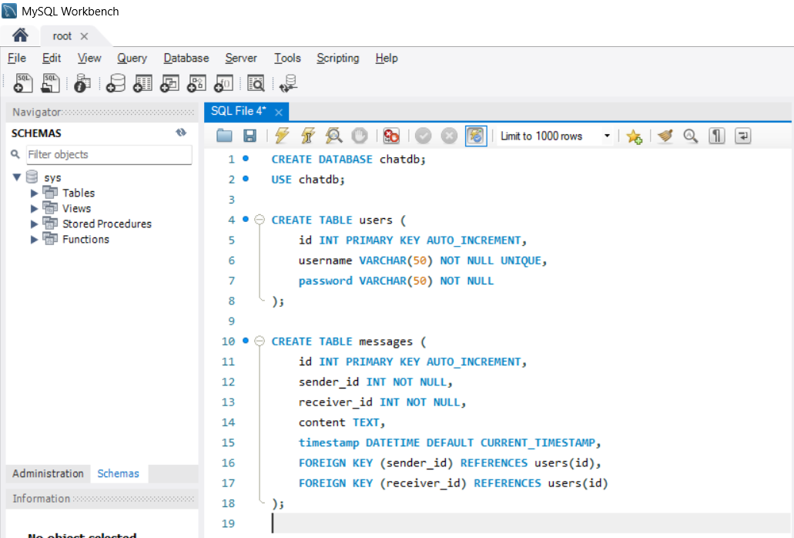{width="6.267716535433071in"
height="4.25in" #fig-image23}

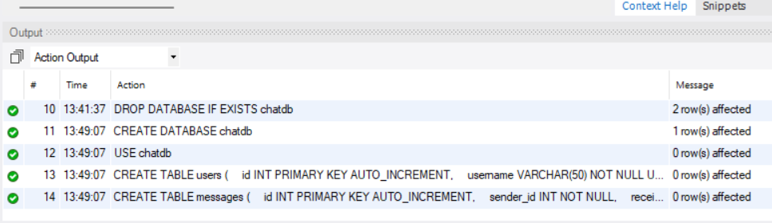{width="6.267716535433071in"
height="1.8194444444444444in" #fig-image16}

После создания таблиц следует добавить тестовые учетные записи
пользователей вручную, поскольку функционала регистрации в клиенте не
реализовано. Минимально достаточно двух пользователей для проверки чата.

Заполним эту таблицу двумя пользователями, например:

-   id = 1, username = \'user1\', password = \'pass1\'

-   id = 2, username = \'user2\', password = \'pass2\'.

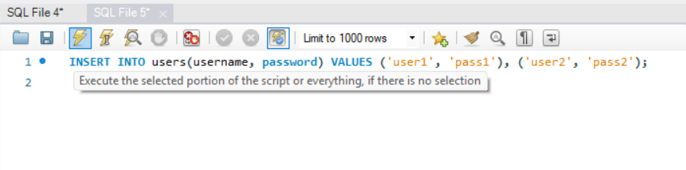{width="6.267716535433071in"
height="1.5555555555555556in" #fig-image18}

Output:

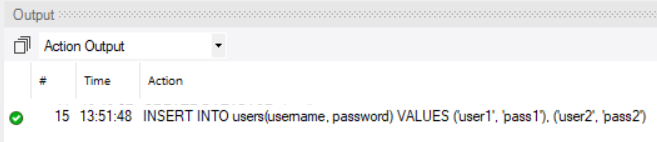{width="6.267716535433071in"
height="1.3611111111111112in" #fig-image20}

## **Реализация клиентского и серверного приложения**

Проект разделен на два исполняемых компонента: серверное приложение и
клиентское приложение. Они могут быть запущены на одном компьютере (для
тестирования) либо на разных. Ниже описаны ключевые детали реализации
обоих компонентов.

### Серверное приложение

Сервер -- это консольное Java-приложение (Server.java), которое
прослушивает входящие подключения по заданному порту и обрабатывает их в
отдельных потоках. Основные этапы работы сервера:

-   Запуск сервера: При старте сервер загружает драйвер MySQL и
    подключается к базе данных (используя JDBC). Если соединение с БД
    установить не удалось, сервер завершает работу, выдавая ошибку.
    Затем открывается серверный сокет (ServerSocket) на указанном порту
    (по умолчанию порт 12345). Сервер готов принимать клиентов.

-   Ожидание подключений: В главном цикле серверного приложения
    выполняется accept() -- ожидание нового входящего соединения от
    клиента. Когда клиент подключается, сервер создает новый объект
    ClientHandler -- поток обработки этого клиента -- и запускает его.
    Таким образом, для каждого подключенного клиента функционирует свой
    поток, что позволяет обслуживать несколько клиентов параллельно.

-   Аутентификация клиента: Каждый поток ClientHandler сначала ожидает
    от клиента сообщение с данными для логина. Клиент сразу после
    подключения отправляет строку вида \"LOGIN\|username\|password\"
    (разумеется, в зашифрованном виде). Поток расшифровывает сообщение с
    помощью CryptoUtil.decrypt(\...) и извлекает введенные логин и
    пароль. Затем выполняется проверка: обращается к базе данных
    (SQL-запрос к таблице users) для поиска пользователя с таким именем
    и паролем. Если пользователь не найден или пароль неверный -- сервер
    отправляет обратно клиенту ответ об ошибке входа и закрывает
    соединение. Если данные верны, сервер дополнительно проверяет, не
    залогинен ли уже этот пользователь в текущий момент (на случай, если
    запущены два клиента с одинаковыми учетными данными). При успехе
    сервер регистрирует нового подключенного пользователя: сохраняет его
    имя и ID, добавляет в список активных клиентов. После этого сервер
    отправляет клиенту подтверждение успешного входа.

-   Обмен сообщениями: После авторизации поток ClientHandler переходит в
    цикл ожидания сообщений от данного клиента. Любое полученное от
    клиента сообщение (формата \"MSG\|recepient\|text\")
    расшифровывается и обрабатывается. Сервер извлекает из него имя
    адресата и собственно текст. Далее сервер ищет, подключен ли сейчас
    получатель с таким именем:

    -   Если получатель онлайн (есть соответствующий объект
        ClientHandler в списке активных), сервер берет исходный текст
        сообщения, сохраняет его в базу данных (таблица messages) и
        пересылает получателю. Пересылка происходит так: сервер
        формирует новую строку \"MSG\|sender\|text\" (где sender -- имя
        отправителя) и шифрует ее, после чего отправляет адресату. Таким
        образом, получатель узнает, от кого пришло сообщение, и сможет
        его расшифровать.

    -   Если получателя нет в сети, сервер отправляет отправителю
        уведомление об ошибке: формирует сообщение \"ERROR\|Пользователь
        \... не в сети.\" (также шифрует и отправляет обратно
        отправителю). Клиент-отправитель при получении такого сообщения
        может уведомить пользователя (в интерфейсе отобразится системное
        сообщение, что адресат недоступен). В текущей реализации
        сообщения несуществующим или офлайн-пользователям не сохраняются
        (т.е. офлайн-доставка не реализована).

-   Отключение клиента: Если клиент закрывает соединение (например,
    пользователь вышел из чата или отключился от сети), поток
    ClientHandler получает null при чтении данных и завершает работу.
    При этом сервер удаляет данного пользователя из списка активных
    (освобождая его имя для возможности последующего входа), закрывает
    его сокет и освобождает ресурсы. Также можно видеть соответствующие
    сообщения на консоли сервера (например, что пользователь
    отключился).

Сервер не имеет собственного графического интерфейса -- все события
(подключение, вход, ошибки БД) логируются в консоль. Это упрощает
развертывание сервера.

### **Клиентское приложение**

Клиент -- это Swing-приложение с удобным графическим интерфейсом,
позволяющим пользователю подключиться к серверу и обмениваться
сообщениями. Клиентская часть состоит из двух основных окон (форм): окно
входа и окно самого чата. Соответственно, в коде выделены классы
LoginFrame и ChatFrame.

-   Окно входа (LoginFrame): при запуске клиента появляется окно с
    полями ввода: «Имя пользователя», «Пароль», «Адрес сервера» и
    «Порт», а также кнопкой «Войти». Все надписи и подсказки -- на
    русском языке. Пользователь вводит свой логин/пароль (которые должны
    быть заранее зарегистрированы в базе данных) и указывает адрес
    сервера (например, localhost) и порт (по умолчанию 12345, уже
    заполнен). По нажатию кнопки «Войти» происходит попытка подключения
    к серверу:

    -   Клиент создает сокет, подключаясь к указанному адресу и порту.
        Если соединиться не удалось (сервер недоступен, неверный
        адрес/порт), выдается сообщение об ошибке («Не удалось
        подключиться к серверу»).

    -   После успешного установления соединения клиент формирует строку
        с логином и паролем в формате \"LOGIN\|username\|password\". Эту
        строку программа шифрует с помощью CryptoUtil.encrypt(\...) и
        отправляет на сервер через сокет.

    -   Клиент ждет ответ от сервера. Сервер вернет либо \"LOGIN_OK\" (в
        случае успеха), либо \"LOGIN_FAIL\" (в случае неуспешной
        авторизации). Ответ тоже придет в зашифрованном виде, поэтому
        клиент сначала дешифрует его. Если ответ положительный, окно
        входа закрывается, и открывается основное окно чата. Если сервер
        вернул отказ, на экране появится сообщение об ошибке («Неверное
        имя пользователя или пароль»), и соединение будет закрыто -- при
        желании можно повторить попытку ввода.

-   Окно чата (ChatFrame): после успешного входа открывается главное
    окно чата. В его заголовке отображается название («Чат») и логин
    текущего пользователя. Окно состоит из следующих элементов:

    -   Метка с вашим логином и поле для ввода имени получателя (подпись
        «Получатель:»). Перед отправкой сообщений пользователь должен
        указать логин того, кому хочет написать. (В текущей версии
        список пользователей не подгружается автоматически, поэтому имя
        получателя вводится вручную.)

    -   Большая текстовая область, где отображается переписка (чат).
        Здесь появляются сообщения -- как отправляемые самим
        пользователем (с префиксом «Вы:»), так и полученные от
        собеседника (с именем отправителя). Системные уведомления
        (например, ошибки доставки) также отображаются в этой области в
        квадратных скобках, например \[Система\]: Пользователь \... не в
        сети..

    -   Поле ввода нового сообщения и кнопка «Отправить». Пользователь
        набирает текст сообщения в текстовом поле внизу окна. При
        нажатии Enter (или кнопки «Отправить») сообщение будет
        отправлено.

Отправка сообщения с клиента: при нажатии кнопки или Enter, клиент
выполняет следующие действия:

-  Берет содержимое поля «Получатель» (имя адресата) и поля ввода
    сообщения. Если поле получателя пустое, выдается предупреждение
    («Укажите имя получателя.») -- отправка не происходит. Если текст
    сообщения пустой, ничего не делается.

-  Формируется строка формата \"MSG\|recepient\|text\", где recepient
    -- логин получателя, а text -- содержание сообщения. Например:
    \"MSG\|user2\|Привет, как дела?\". Затем эта строка шифруется с
    помощью CryptoUtil.encrypt(\...).

-  Зашифрованная строка отправляется на сервер через открытое
    соединение (PrintWriter сокета).

-  После успешной отправки сообщение сразу же отображается в локальной
    текстовой области чата с пометкой «Вы: \...». Таким образом,
    пользователь видит свое отправленное сообщение в истории переписки
    сразу (даже до получения подтверждения от сервера).

Получение сообщений на клиенте: при открытии окна чата в клиенте
запускается фоновый поток, который постоянно слушает входящий поток
сокета (BufferedReader). Этот поток ожидает данные от сервера:

-   Когда приходит строка, поток ее считывает, расшифровывает с помощью
    CryptoUtil.decrypt(\...) и анализирует. Если сообщение начинается с
    \"MSG\|\", значит это обычное сообщение от другого пользователя.
    Клиент разбивает строку и извлекает имя отправителя и текст, после
    чего добавляет строку в текстовую область чата в формате:
    \<отправитель\>: \<текст\>. Пользователь, получивший сообщение,
    увидит в окне, например, user1: Привет, как дела?.

-   Если входящее сообщение начинается с \"ERROR\|\", значит сервер
    вернул уведомление об ошибке (например, попытка отправить сообщение
    несуществующему или отключившемуся пользователю). В таком случае
    клиент выводит в области чата текст ошибки с пометкой \[Система\].
    Например: \[Система\]: Пользователь user2 не в сети.. Это служит
    подсказкой пользователю, что сообщение не было доставлено.

Фоновый поток приема сообщений работает до тех пор, пока соединение
открыто. Если сервер или сеть разорвали соединение (линия readLine()
вернула null или выдала исключение), поток завершается. В окне чата это
отобразится как системное сообщение \[Система\]: Соединение закрыто..
После этого отправка новых сообщений станет невозможна (соединение
потеряно).

Завершение работы клиента: Когда пользователь закрывает окно чата (нажав
на \[X\]), приложение закрывает сетевое соединение (сокет) и выходит. В
коде добавлен обработчик события закрытия окна, который корректно
закрывает Socket и потоки ввода/вывода, уведомляя сервер о отключении.
Сервер после этого удалит пользователя из списка онлайн. При
необходимости пользователь может снова запустить клиент и зайти заново.

## **Структура проекта и исходный код**

Проект организован как единый Eclipse-проект с двумя запускаемыми
классами. Ниже представлена структура исходных файлов и их содержимое.
Комментарии в коде поясняют ключевые моменты работы (на русском языке).

Создадим новый проект в среде Eclipse:

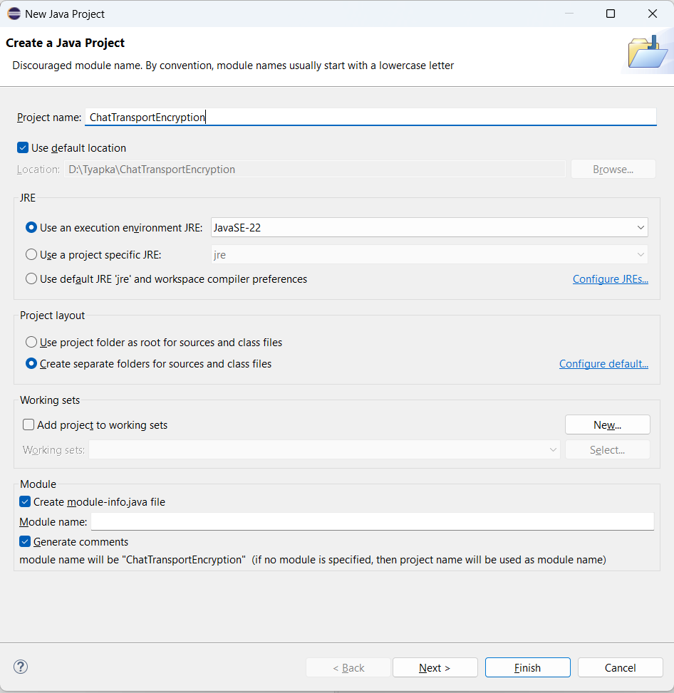{width="6.267716535433071in"
height="6.444444444444445in" #fig-image12}

В созданном проекте в директории src создадим пакет, com.example.chat:

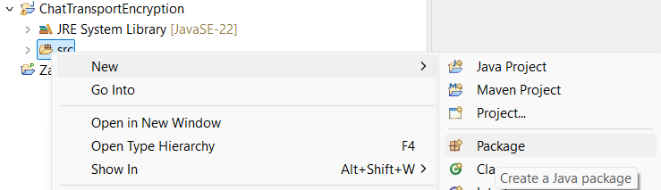{width="6.267716535433071in"
height="1.8055555555555556in" #fig-image17}

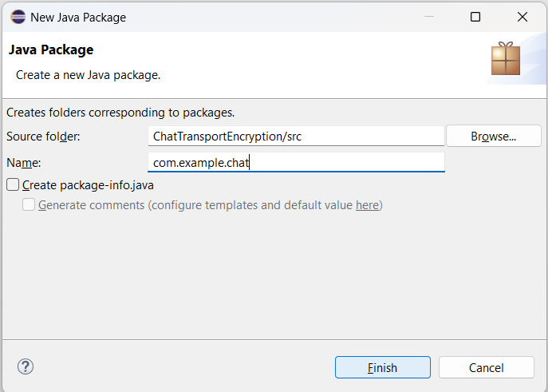{width="6.267716535433071in"
height="4.486111111111111in" #fig-image4}

Далее для корректной работы, добавим в проект JDBC-драйвер для MySQL

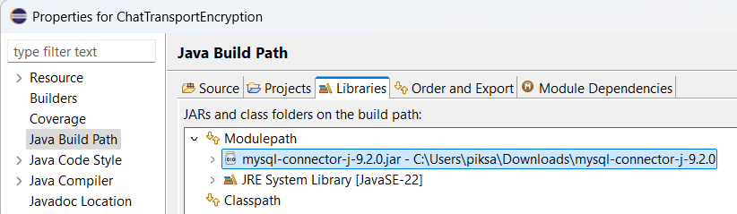{width="6.267716535433071in"
height="1.8194444444444444in" #fig-image15 #fig-image15}

Создаем классы в src:

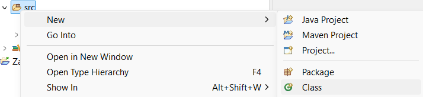{width="6.267716535433071in"
height="1.4444444444444444in" #fig-image25}

Server.java -- главный класс серверного приложения. Запускает сервер,
устанавливает соединение с БД, принимает подключения и создает
потоки-обработчики. Также содержит методы для сохранения сообщений в БД.

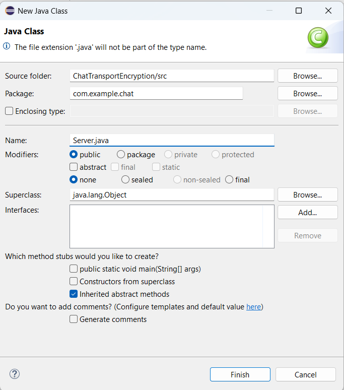{width="6.267716535433071in"
height="7.097222222222222in" #fig-image2}

Cервер использует класс CryptoUtil для шифрования/дешифрования (код
которого приведен ниже). Сервер реагирует на сообщения с префиксами
LOGIN\|, MSG\| и ERROR\| согласно описанной логике. Все операции с базой
данных (проверка пароля, получение id, запись сообщения) выполняются
через стандартный JDBC. Обратите внимание, что метод saveMessage
объявлен synchronized -- это предотвращает одновременное выполнение
вставки из разных потоков. Контейнер clients (карта активных
пользователей) -- это ConcurrentHashMap, что позволяет потокам безопасно
обращаться к ней без дополнительной синхронизации при чтении/записи.

CryptoUtil.java -- утилитный класс для шифрования/дешифрования
(используется и на сервере, и на клиенте).

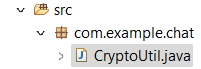{width="2.09375in"
height="0.71875in" #fig-image11}

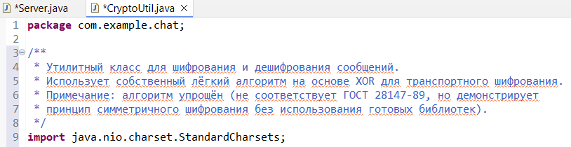{width="6.267716535433071in"
height="1.6111111111111112in" #fig-image22}

## **Клиентская часть (Java, Swing GUI)**

ClientMain.java -- класс с методом main, точка входа клиентского
приложения. Он устанавливает стиль интерфейса (Look & Feel) и открывает
окно логина.

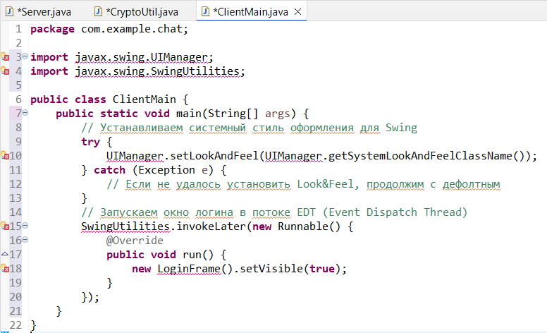{width="6.267716535433071in"
height="3.8055555555555554in" #fig-image19}

LoginFrame.java -- класс окна входа. Предоставляет форму для ввода
учетных данных и соединения с сервером.

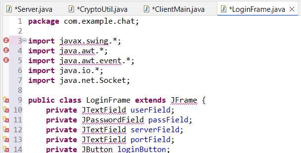{width="6.267716535433071in"
height="3.1944444444444446in" #fig-image3}

ChatFrame.java -- класс главного окна чата. Содержит интерфейс для
отображения и отправки сообщений, а также фоновый поток для получения
сообщений от сервера.

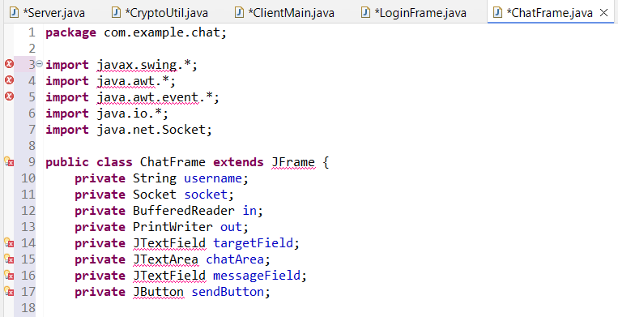{width="6.267716535433071in"
height="3.2083333333333335in" #fig-image10}

Мы прописали все в проекте, теперь запустим его:

Запуск сервера: Запустим класс Server как Java Application:

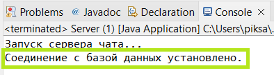{width="4.104166666666667in"
height="1.1354166666666667in" #fig-image6}

Отлично, это означает, что сервер успешно стартовал и слушает порт.
Далее, запустим класс ClientMain (Run As -\> Java Application).
Откроется окно «Вход в чат».

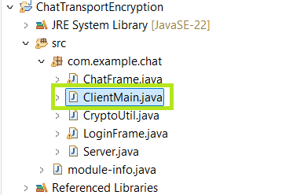{width="3.7395833333333335in"
height="2.5833333333333335in" #fig-image7}

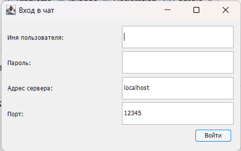{width="4.413017279090114in"
height="2.7604057305336833in" #fig-image24}

Вводим данные для входа:

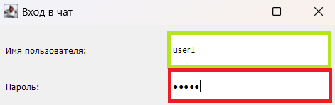{width="4.90625in"
height="1.5416666666666667in" #fig-image8}

Открывается чат:

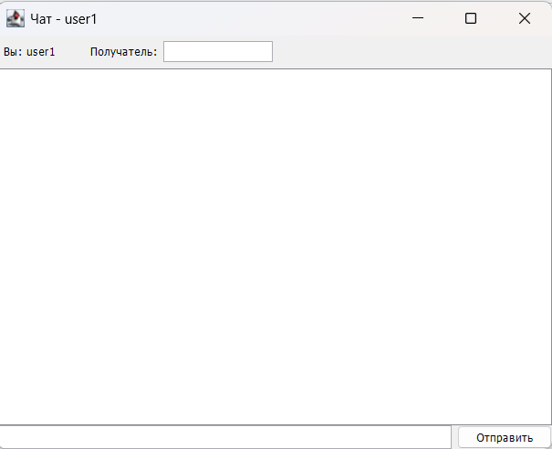{width="5.109375546806649in"
height="4.150306211723534in" #fig-image14}

Подключение второго клиента: Для проверки обмена сообщениями нужен
второй клиент. Здесь уже USER2

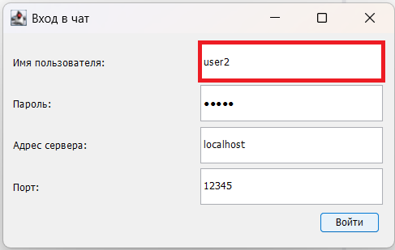{width="5.072916666666667in"
height="3.21875in" #fig-image21}

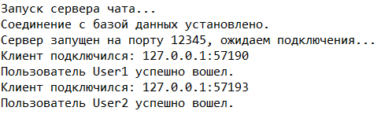{width="5.041666666666667in"
height="1.6145833333333333in" #fig-image5}

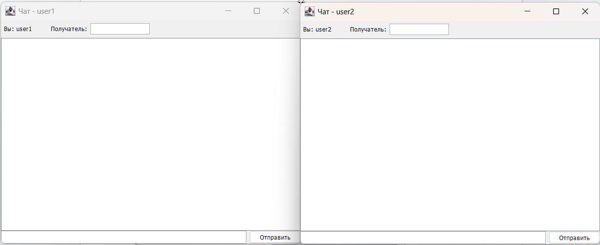{width="6.267716535433071in"
height="2.5694444444444446in" #fig-image9}

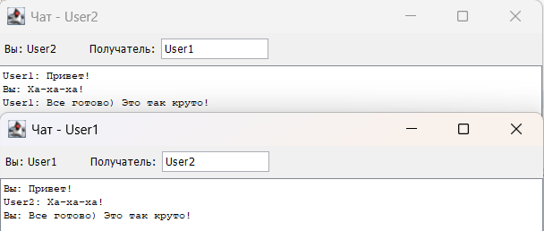{width="6.267716535433071in"
height="2.6527777777777777in" #fig-image1}

Проверка ошибок: Можно протестировать ситуацию, когда указанный
получатель недоступен. Если в поле «Получатель» допустить ошибку или
отправить сообщение до того, как второй пользователь вошел, сервер не
найдет адресата и вернет ошибку. В таком случае в окне чата появится
сообщение от системы.

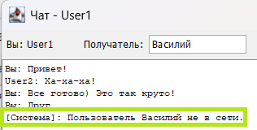{width="4.068160542432196in"
height="2.059828302712161in" #fig-image13}

Завершение работы: Чтобы закрыть чат, достаточно закрыть окно чата
(кнопка \[X\] в углу). Приложение завершается, сокет закрывается -- на
сервере отобразится уведомление об отключении пользователя. Сервер
продолжит работать, ожидая новые подключения.

# **Заключение**

В ходе выполнения курсовой работы была разработана система обмена
сообщениями в режиме реального времени, основанная на клиент-серверной
архитектуре с использованием языка Java. В приложении реализован
графический интерфейс (Swing), обеспечивающий удобство работы
пользователя, а также интеграция с базой данных MySQL, где хранится
основная информация (учетные данные, история переписки). Одним из
ключевых достижений проекта стала реализация собственного алгоритма
легковесного транспортного шифрования, позволяющего надежно защитить
передаваемые сообщения без использования стандартных протоколов TLS/SSL.

Созданное приложение предоставляет базовые, но практически значимые
функции: регистрация и авторизация пользователей, отправка и получение
сообщений в режиме реального времени, а также сохранение истории чатов.
Для обеспечения стабильной работы системы применена многопоточная модель
на стороне сервера: она позволяет обрабатывать несколько запросов
параллельно и оперативно оповещать адресатов о новых сообщениях.
Механизм аутентификации через базу данных MySQL делает процесс
безопасным и дает возможность расширения функционала в будущем
(например, реализация ролевой модели доступа или дополнительные
настройки для пользователей).

Итоги и выводы по работе можно сформулировать следующим образом:

-   Кроссплатформенность и удобство. Выбранный язык Java и библиотека
    Swing позволили создать наглядное приложение, которое может быть
    запущено на разных операционных системах.

-   Безопасность передачи данных. Разработанный алгоритм шифрования
    гарантирует конфиденциальность сообщений.

-   Гибкая архитектура. Клиент-серверная модель с применением
    TCP-соединений дает возможность легко масштабировать систему,
    обслуживая одновременно несколько пользователей.

-   Модульность и перспектива развития. Реализованная структура кода и
    архитектуры предоставляет простор для дальнейших доработок и
    улучшений: от добавления новых функций до интеграции с внешними
    сервисами.

-   Практическая значимость. Полученный результат может служить основой
    для более сложных корпоративных мессенджеров или учебных проектов,
    связанных с безопасным обменом информацией.

В целом, разработанный чат-мессенджер демонстрирует умение применять
теоретические знания на практике, разрабатывать и отлаживать сетевые
приложения, работать с базами данных, а также решать задачи безопасности
на уровне транспортного шифрования. Дальнейшее расширение функционала и
улучшение удобства интерфейса открывает широкие перспективы для
использования данного прототипа как в образовательных, так и в
прикладных целях.

# **Приложение**

Ввиду большого обьема кодовой базы, для ознакомления с ней необходимо перейти
по следующей ссылке на публичную систему контроля версий `github.com`
[https://github.com/MuskyKetchup/fa-term-paper-2024](https://github.com/MuskyKetchup/fa-term-paper-2024)

# **Список литературы**

1)  Oracle Documentation. The Java™ Tutorials. \[Электронный ресурс\].
    Доступно на:
    [[https://docs.oracle.com/javase/tutorial/]{.underline}](https://docs.oracle.com/javase/tutorial/)
    (Официальная документация по языку Java, включая работу с сетью,
    многопоточность и основы GUI на Swing).

2)  Oracle Documentation. Java™ Platform, Standard Edition.
    \[Электронный ресурс\]. Доступно на:
    [[https://docs.oracle.com/javase/]{.underline}](https://docs.oracle.com/javase/)
    (Подробные спецификации платформы Java SE).

3)  MySQL Reference Manual. MySQL 8.0 Reference Manual. \[Электронный
    ресурс\]. Доступно на:
    [[https://dev.mysql.com/doc/refman/8.0/en/]{.underline}](https://dev.mysql.com/doc/refman/8.0/en/)
    (Официальное руководство по MySQL, включающее разделы по
    администрированию, проектированию БД и написанию SQL-запросов).

4)  Винокуров, И. В. Использование библиотек классов Swing и MFC для
    разработки графического интерфейса пользователя : учебное пособие /
    И. В. Винокуров. --- 2-е изд., стер. --- Москва : МГТУ им.
    Баумана, 2011. --- 396 с. --- ISBN 978-5-7038-3560-9. --- Текст :
    электронный // Лань : электронно-библиотечная система. --- URL:
    [[https://e.lanbook.com/book/106519]{.underline}](https://e.lanbook.com/book/106519)
    (дата обращения: 18.03.2025). --- Режим доступа: для авториз.
    пользователей.

5)  Зорина, Н. В. Программирование на языке Джава : учебное пособие / Н.
    В. Зорина. --- Москва : РТУ МИРЭА, 2021 --- Часть 1 --- 2021. ---
    148 с. --- Текст : электронный // Лань : электронно-библиотечная
    система. --- URL:
    [[https://e.lanbook.com/book/218423]{.underline}](https://e.lanbook.com/book/218423)
    (дата обращения: 18.03.2025). --- Режим доступа: для авториз.
    пользователей.

6)  Крыжановская, Ю. А. Основы JAVA : учебное пособие / Ю. А.
    Крыжановская, В. Г. Ляликова, М. М. Безрядин. --- Воронеж :
    ВГУ, 2020. --- 96 с. --- Текст : электронный // Лань :
    электронно-библиотечная система. --- URL:
    [[https://e.lanbook.com/book/433010]{.underline}](https://e.lanbook.com/book/433010)
    (дата обращения: 20.03.2025). --- Режим доступа: для авториз.
    пользователей.

7)  Монахов, В. В. Язык программирования Java и среда NetBeans : учебное
    пособие / В. В. Монахов. --- 2-е изд. --- Москва : ИНТУИТ, 2016. ---
    450 с. --- Текст : электронный // Лань : электронно-библиотечная
    система. --- URL:
    [[https://e.lanbook.com/book/100544]{.underline}](https://e.lanbook.com/book/100544)
    (дата обращения: 17.03.2025). --- Режим доступа: для авториз.
    пользователей.

8)  Рацеев, С. М. Криптография. Безопасные многосторонние вычисления :
    учебное пособие для вузов / С. М. Рацеев. --- Санкт-Петербург :
    Лань, 2025. --- 468 с. --- ISBN 978-5-507-50213-4. --- Текст :
    электронный // Лань : электронно-библиотечная система. --- URL:
    [[https://e.lanbook.com/book/440033]{.underline}](https://e.lanbook.com/book/440033)
    (дата обращения: 22.03.2025). --- Режим доступа: для авториз.
    пользователей.

9)  Цехановский, В. В. Распределенные информационные системы : Учебник
    для СПО / В. В. Цехановский, В. Д. Чертовской. --- 2-е, стер. ---
    Санкт-Петербург : Лань, 2021. --- 240 с. --- ISBN 978-5-8114-7584-1.
    --- Текст : электронный // Лань : электронно-библиотечная система.
    --- URL:
    [[https://e.lanbook.com/book/162391]{.underline}](https://e.lanbook.com/book/162391)
    (дата обращения: 20.03.2025). --- Режим доступа: для авториз.
    пользователей.

10) Шационок, П. В. Разработка программных систем на основе объектного
    подхода : учебно-методическое пособие / П. В. Шационок, К. Э.
    Врублевский. --- Москва : РУТ (МИИТ), 2024. --- 48 с. --- Текст :
    электронный // Лань : электронно-библиотечная система. --- URL:
    [[https://e.lanbook.com/book/459782]{.underline}](https://e.lanbook.com/book/459782)
    (дата обращения: 15.03.2025). --- Режим доступа: для авториз.
    пользователей.
